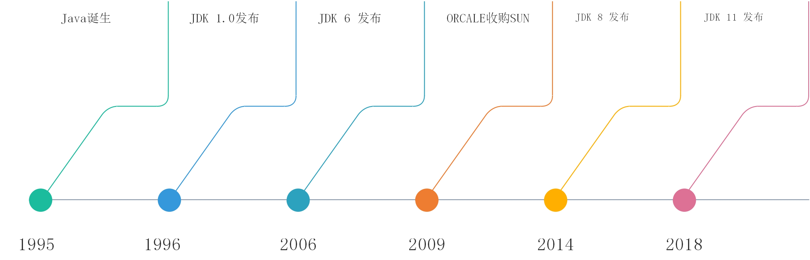

# 简介

本节内容从一个 HelloWorld 示例程序开始，讲解 Java 基础语法内容。主要包含变量、常量、数据类型、String、运算符、关键字和语句、方法以及 IDE 的介绍。

## Java 概述及版本

Java 是由 Sun Microsystems 公司于 1995 年 5 月推出的 Java 程序设计语言（以下简称 Java 语言）和 Java 平台的总称。Java 语言是一种面向对象的编程语言。虽然 Java 仅仅只产生了短短 20 年，但是它的发展是非常迅速的。在 2009 年 4 月 20 号，ORACLE 收购了 Sun 公司，也就是说 Java 这门语言现在归属于 ORACLE 这家公司门下。



在 Java 这门语言体系当中，最基础的部分就是 Java SE 部分，Java 的标准版本。它包括 Java 最基础的一些结构，包括面向对象的一些特性等等，同时它也是 Java 技术基础和核心。在 Java SE 的基础之上，又分为了 Java EE（Java 的企业版），应用于大型企业级应用的开发。Java ME 主要用于嵌入式开发。初学的时候我们都是从 Java SE 开始的。


JVM 叫 Java 虚拟机，它也是整个 Java 技术的核心。Java 语言的跨平台就多亏了 JVM。

JDK 叫 Java 开发工具包，没有 JDK 就没有办法进行 Java 程序的开发。

JRE 叫 Java 运行环境，如果我们需要运行一个 Java 程序，就得安装 JRE。

JDK、JRE 和 JVM 之间的关系：


#### 学习方法

推荐同学们在学习的同时可以边看文档边动手写代码，在遇到不懂的问题时可以查看实验楼其他课程或者查看官方文档解决。

## HelloWorld

每门语言学习前，都会有一个 HelloWorld 的示例，Java 当然也不例外。
在 `/home/project/` 下新建一个文件 `HelloWorld.java`。


```java
public class HelloWorld{
    public static void  main(String[] args){
        System.out.println("HelloWorld!");
    }
}
```

上面的例子虽然简单，但是包含了很多的知识点，Java 中所有的代码都必须包含在 class 中，`main` 方法是程序的入口，并且 Java 是**区分大小写**的，如果写成 Main，那么程序将因找不到程序入口而无法运行。使用 `public` 修饰的 `class` 名（`HelloWorld`）须和源代码文件名相同。

编译源代码：打开命令行，切换到源代码目录，这里是 `/home/project`。输入 `javac HelloWorld.java`，如果程序没有任何提示，并且在同级目录下生成了一个 `.class` 扩展名的文件，那么说明编译成功，反之编译失败。

运行程序：输入 `java HelloWorld`，这个时候不需要再添加扩展名了。

```bash
$ javac HelloWorld.java
$ java HelloWorld
HelloWorld!
```


## IDE

Java 常见的 IDE 有 IDEA，Eclipse 等，同学们可以任选一种安装在本地学习，在实验楼环境中并不会使用这两种 IDE，而是使用 WebIDE 进行开发，同学们需要将这两种 IDE 之一装在本地进行学习。
